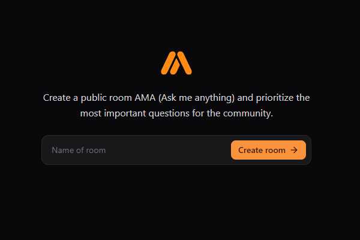
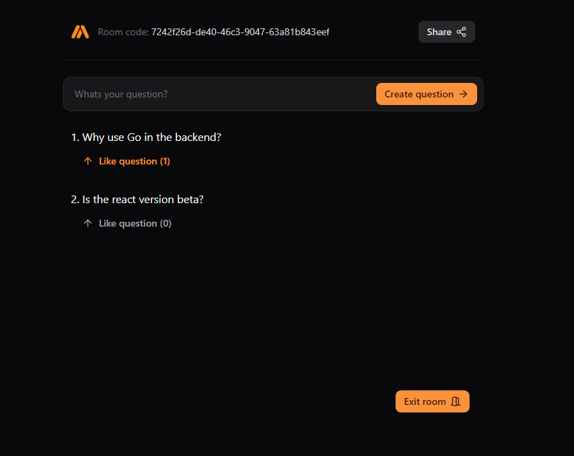

# AMA - (Ask me anything)
<a id="readme-top"></a>

<br />
<div align="center">

  

  <h3 align="center">AMA | Ask me anything</h3>

  <p align="center">
    An incredible project to create rooms and messages with websocket using Go on the backend and React on the frontend!
    <br />
  </p>
</div>


## 📃 About The Project

- Room creation;
- Question creation;
- Question reaction;
- Question answered;
- Share room link.

<p align="right">(<a href="#readme-top">back to top</a>)</p>

## 💎 Built With

* [![Go][Go]][Go-url]
* [![Node][Node]][Node-url]
* [![React][React]][React-url]
* [![Vite][Vite]][Vite-url]
* [![Tailwind][Tailwind]][Tailwind-url]
* [![Postgres][Postgres]][Postgres-url]
* [![Docker][Docker]][Docker-url]

<p align="right">(<a href="#readme-top">back to top</a>)</p>

## ⏱️ Getting Started

This is an example of how you can run your project locally.

To get a local copy up and running follow these simple example steps.

## 🛠️ Prerequisites

* docker <br>
    [Download Docker and see the documentation how to install and start](https://docs.docker.com/desktop/install/windows-install/)

* postgres <br>
    [Download Postgres](https://www.postgresql.org/download/)
    [Documentation Postgres](https://www.postgresql.org/docs/)

* go <br>
    [Documentation to install Go](https://go.dev/doc/)


* npm
  ```sh
  npm install npm@latest -g
  ```
  after if you want use yarn:
  ```sh
  npm install --global yarn
  ```

<p align="right">(<a href="#readme-top">back to top</a>)</p>

## 🪄 Installation

1. Clone the repo
   ```sh
   git clone git@github.com:rike14/go_react.git
   ```

<p align="right">(<a href="#readme-top">back to top</a>)</p>

## ⚙️ Backend

2. Run backend
   ```sh
    cd backend-go/
   ```

   * npm
   ```sh
   npm install 
   ```

    *Or with yarn*

   * yarn
   ```sh
   yarn
   ```

   ```sh
    # for the first time or every time do you change the compose.yml file do you need run this command, wait build the image and volume stop the terminal/cmd with ctrl+c command
    docker compose up 

    # after run the command docker compose up, then only run the command below to start container
    docker compose start

    # to access Pgadmin on http:localhost:8081 with email and password do you set on compose.yml
    # PGADMIN_DEFAULT_EMAIL: what_you_want@email.com
    # PGADMIN_DEFAULT_PASSWORD: password_you_want
    # then you register a server name what you want, on the tab 'Connection' do you need put on 'Host name/address': db then save like image below

    # command stop de container if you needed
    docker compose stop
   ```
   

   ```sh
    # commands go 
    # url of your project on github is the most usable
    # url example: https://github.com/rike14/go_react
    go mod init url_of_your_project

    # run go mod tidy to install dependencies 
    go mod tidy

    # to create migrations if you want create a new table, then tern create a file inside ./internal/store/pgstore/migrations with the name do you put, then do you need config the table with drop, create, columns.
    # see the example on file ./internal/store/pgstore/migrations/001_create_rooms_table.sql
    tern new --migrations ./internal/store/pgstore/migrations create_name_do_you_want_table

    # command to run your migrations
    go run cmd/tools/terndotenv/main.go

    # command to generate your queries like GetRoom, CreateRoom, GetMessages
    sqlc generate -f ./internal/store/pgstore/sqlc.yaml
    # or if do you have file like gen.go do you can run the command below to run every queries do you have on the backend
    go generate ./ ...

    # to run api
    go run cmd/wsrs/main.go
    # url: http://localhost:8080/api
   
   ```

<p align="right">(<a href="#readme-top">back to top</a>)</p>

## 🏜️ Frontend

3. Run frontend
    ```sh
    cd frontend-react/
    ```

   * npm
   *use -f because some packages are in beta*
   ```sh
   npm install -f 
   ```
   
    *Or with yarn*

   * yarn
   ```sh
   yarn
   ```

   ```sh
   npm run dev

    # or with yarn

    yarn dev

    # in the terminal see running on the url http://localhost:5173/
   ```

<p align="right">(<a href="#readme-top">back to top</a>)</p>

## 🚀 Project

- [x] Home page where do you create a room:
  
  

- [x] Page of the messages room:
  
  

## 🧑🏼‍💻 Author

 
 <br />
 <sub><b>Henrique M. Kronhardt</b></sub></a>
 <br />

[](https://www.linkedin.com/in/henriquekronhardt/)

---

Made with ❤️ by Henrique M. Kronhardt 👋🏽 [Get in touch!](https://www.linkedin.com/in/henriquekronhardt/)

<p align="right">(<a href="#readme-top">back to top</a>)</p>

<!-- MARKDOWN LINKS & IMAGES -->
[Go]: https://img.shields.io/badge/go-%2300ADD8.svg?style=for-the-badge&logo=go&logoColor=white
[Go-url]: https://go.dev/
[Node]: https://img.shields.io/badge/node.js-6DA55F?style=for-the-badge&logo=node.js&logoColor=white
[Node-url]: https://nodejs.org/pt
[React]: https://img.shields.io/badge/React-20232A?style=for-the-badge&logo=react&logoColor=61DAFB
[React-url]: https://reactjs.org/
[Vite]: https://img.shields.io/badge/vite-%23646CFF.svg?style=for-the-badge&logo=vite&logoColor=white
[Vite-url]: https://vitejs.dev/
[Tailwind]: https://img.shields.io/badge/tailwindcss-%2338B2AC.svg?style=for-the-badge&logo=tailwind-css&logoColor=white
[Tailwind-url]: https://tailwindcss.com/
[Postgres]: https://img.shields.io/badge/postgres-%23316192.svg?style=for-the-badge&logo=postgresql&logoColor=white
[Postgres-url]: https://www.postgresql.org/
[Docker]: https://img.shields.io/badge/docker-%230db7ed.svg?style=for-the-badge&logo=docker&logoColor=white
[Docker-url]: https://www.docker.com/